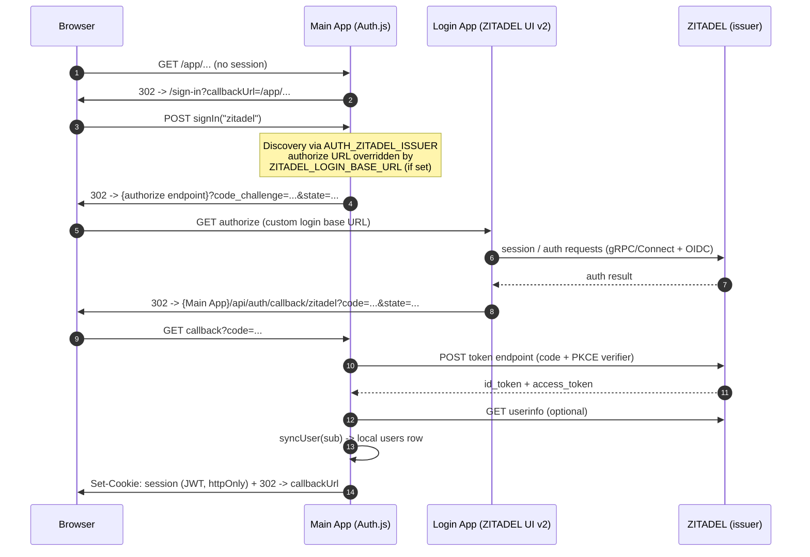
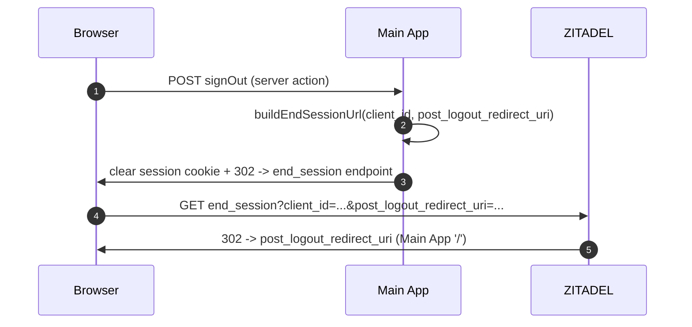

# Main App ↔ Login App ↔ ZITADEL communication

This document describes exactly how the three components talk to each other and
which environment variables control each hop.

## Actors

- **Main App** — OIDC relying party (Auth.js v5).
- **Login App** — self-hosted ZITADEL Login UI v2 (interactive login surface).
- **ZITADEL** — the issuer / identity provider.

## Environment variables per hop

| Variable | Owner | Purpose |
| -------- | ----- | ------- |
| `AUTH_ZITADEL_ISSUER` | Main App | OIDC discovery + token/userinfo/jwks base (the issuer). |
| `AUTH_ZITADEL_ID` / `AUTH_ZITADEL_SECRET` | Main App | OIDC client credentials. |
| `ZITADEL_LOGIN_BASE_URL` | Main App | If set, the **authorize** request is routed here (the Login App) instead of the hosted login. |
| `APP_BASE_URL` | Main App | Public origin of the Main App, used to build absolute `post_logout_redirect_uri`. |
| `ZITADEL_API_URL` | Login App | ZITADEL API base the Login App calls. |
| `ZITADEL_SERVICE_USER_TOKEN` | Login App | Service-user PAT the Login App uses against the ZITADEL API. |

## Login flow (Authorization Code + PKCE)

### Key points

- **PKCE** is always used (Auth.js default for the ZITADEL provider); no client
  secret is exposed to the browser.
- The **authorize** hop is the *only* one that goes through the Login App when
  `ZITADEL_LOGIN_BASE_URL` is set. Token exchange, userinfo, and JWKS remain on
  the issuer, server-to-server.
- The `id_token` is stored **only inside the encrypted Auth.js JWT** (httpOnly
  cookie) as `zitadelIdToken`. It is never placed in `session` and never sent to
  the client. It is kept available as a future `id_token_hint` for logout; the
  current logout uses `client_id` (see below).

## Logout flow (federated)

- Local session is cleared **first** (Auth.js `signOut`), then the browser is
  sent to the ZITADEL `end_session_endpoint` for federated logout.
- The end-session request uses **`client_id` + `post_logout_redirect_uri`**
  (see `signOutAction` in `src/components/layout/actions.ts`). ZITADEL accepts
  this combination as long as the redirect URI is registered.
  `buildEndSessionUrl` also supports `id_token_hint` (which skips ZITADEL's
  logout confirmation screen); wiring the stored `zitadelIdToken` into the
  action is a possible future improvement.
- `post_logout_redirect_uri` must be **registered** in the ZITADEL application
  configuration; wildcards are never used. See
  [ZITADEL_CONFIGURATION.md](./ZITADEL_CONFIGURATION.md).
- If ZITADEL is not configured, logout falls back to local-only sign-out.

## Optional: OIDC protocol forwarding via the Login App

Some deployments front the entire OIDC protocol surface with the Login App
origin. The Login App scaffold ships pure helpers
(`zitadel-login/lib/oidc-proxy.ts`) that identify which paths belong to the
protocol (`/.well-known/`, `/oauth/`, `/oidc/`) and rewrite them to
`ZITADEL_API_URL`, preserving path and query. Wiring these into a route handler
is left to the vendored upstream app, which owns the interactive UI.
