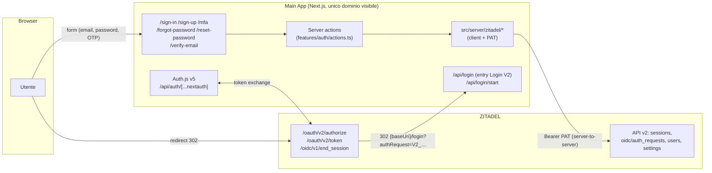
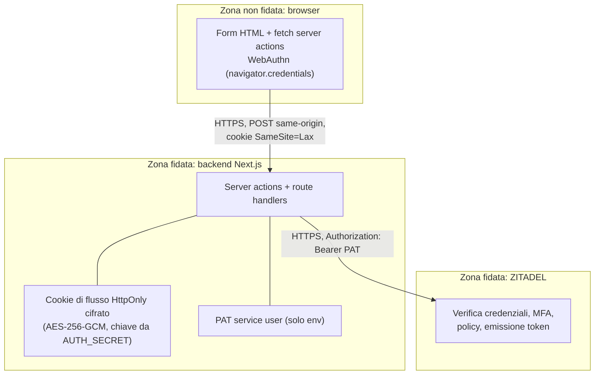

# Architettura — Custom Login UI ZITADEL

Gausio ospita al proprio interno sia l'applicazione sia la Login UI: l'utente
non vede mai le pagine di ZITADEL. ZITADEL resta l'unica autorità per
identità, password, MFA e policy; Auth.js resta il relying party OIDC che
gestisce la sessione applicativa.

## Componenti e responsabilità

| Componente | Responsabilità |
| --- | --- |
| **Auth.js v5** (`src/server/auth`) | Relying party OIDC: authorize request (PKCE, state, nonce), callback, token exchange, sessione applicativa JWT in cookie HttpOnly, sync utente su Postgres. Conserva l'`id_token` per il logout OIDC. |
| **ZITADEL** | Identity Provider: utenti, credenziali, MFA, policy (login, complessità password, lockout), invio email (verifica, reset, OTP), emissione token OIDC. |
| **Pagine auth custom** (`src/app/(auth)`, `src/features/auth`) | UI di login, MFA, registrazione, verifica email, recupero/reset password. Solo presentazione + server actions. |
| **Server actions** (`src/features/auth/actions.ts`) | Unico canale del browser: validano input (zod), applicano rate limiting, chiamano le API ZITADEL, gestiscono il cookie di flusso, finalizzano la auth request. |
| **Client API ZITADEL** (`src/server/zitadel/*`) | Wrapper tipizzati di Session API v2, OIDC Service v2, User Service v2, Settings v2; autenticazione con PAT del service user; mappatura errori sicura. |
| **Entry point Login V2** (`/api/login`) | Riceve il redirect di ZITADEL (`?authRequest=V2_…`); con un flusso completo nel cookie finalizza subito la auth request (handshake invisibile), altrimenti instrada al form (`/sign-in`, `/sign-up` per prompt=create). |
| **Handshake OIDC** (`/api/login/start`) | Invocata **dopo** l'autenticazione: `signIn("zitadel")` crea la authorize request OIDC con i cookie PKCE/state/nonce. |

## Vista d'insieme

## Trust boundaries

Regole al confine:

- la **password** attraversa solo il confine browser → server action → ZITADEL;
  mai browser → ZITADEL, mai loggata, mai persistita;
- il **PAT** vive solo nell'env del server; il browser non lo vede mai;
- il **sessionToken ZITADEL** vive solo nel cookie di flusso HttpOnly cifrato
  e muore alla finalizzazione (≤ 15 minuti);
- il browser riceve esclusivamente: HTML, messaggi d'errore uniformi,
  challenge WebAuthn (dato pubblico) e redirect validati.

## Le due sessioni

| | Sessione ZITADEL | Sessione applicativa |
| --- | --- | --- |
| Creata da | Session API v2 (login custom) | Auth.js dopo il token exchange |
| Vive in | ZITADEL (lifetime 5h) | Cookie JWT Auth.js (HttpOnly) |
| Riferimento lato app | Cookie di flusso cifrato, solo durante il login | Cookie `authjs.session-token` |
| Terminata da | `end_session` (id_token_hint) al logout | `signOut()` Auth.js |

L'ordine è **form-first**: l'utente autentica prima credenziali e MFA sul
form custom (Session API); solo a fattori completi parte l'handshake OIDC
(`/api/login/start` → authorize → `/api/login`), dove la sessione ZITADEL
viene agganciata alla auth request con `POST /v2/oidc/auth_requests/{id}`.
La `callbackUrl` restituita riporta il code ad Auth.js che costruisce la
sessione applicativa. Da lì in poi il cookie di flusso viene eliminato e fa
fede solo la sessione Auth.js. L'intero handshake è fatto di soli redirect
302: l'utente non vede mai una pagina ZITADEL.

## MFA

La logica di orchestrazione (quale passo manca) è in
`src/server/zitadel/mfa.ts` ed è pura: incrocia i `factors` della sessione,
gli `authentication_methods` dell'utente e i login settings (`forceMfa`).
La **verifica** dei fattori avviene sempre su ZITADEL via
`PATCH /v2/sessions/{id}`:

- TOTP → `checks.totp.code`;
- OTP email/SMS → challenge (`challenges.otpEmail/otpSms`) poi
  `checks.otpEmail/otpSms.code`;
- passkey/U2F → `challenges.webAuthN` → `navigator.credentials.get()` →
  `checks.webAuthN.credentialAssertionData`.

Ogni `PATCH` riuscito restituisce un nuovo `sessionToken`, ricifrato nel
cookie di flusso.

## OIDC

Il protocollo resta OIDC standard, non modificato: discovery, authorize,
token e end_session vivono sul dominio ZITADEL; solo le **pagine** di login
vivono sull'app (feature Login V2 con `baseUri` puntata all'app). Auth.js
esegue Authorization Code Flow + PKCE con state e nonce; l'app non decodifica
né costruisce mai JWT OIDC a mano.

Vedi anche: `docs/AUTH_FLOW.md` (sequenze), `docs/ZITADEL_CONFIGURATION.md`
(setup istanza), `docs/SECURITY.md` (threat model).
