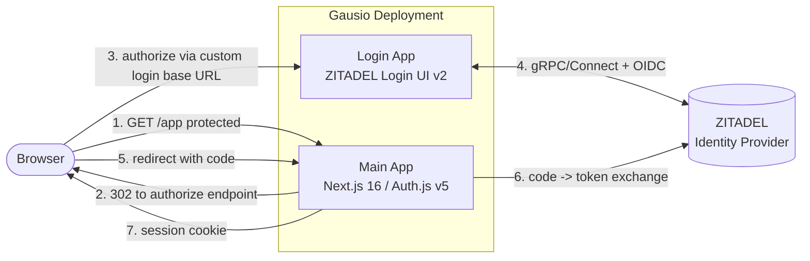

# Architecture

This repository hosts **two cooperating applications** plus a self-hosted
identity provider:

| Component | Path | Runtime | Role |
| --------- | ---- | ------- | ---- |
| **Main App** (Gausio) | repo root (`src/`) | Next.js 16 | The business application. Relying party (OIDC client) via Auth.js v5. |
| **Login App** | [`zitadel-login/`](../zitadel-login) | Next.js 16 | Sibling scaffold that tracks the upstream **ZITADEL Login UI v2** and serves the interactive login flows. |
| **ZITADEL** | external | ZITADEL | The identity provider (issuer). Owns users, sessions, tokens. |

> The Login App is kept as a **sibling folder**, not a monorepo package, so the
> Main App's existing npm build, tooling, and deployment are untouched. See the
> [decision record](#why-a-sibling-folder) below.

## High-level topology

## Authentication model

- **Protocol:** OpenID Connect, Authorization Code Flow **with PKCE**.
- **Client:** Auth.js v5 (`next-auth`) with the built-in `Zitadel` provider,
  configured in [`src/server/auth/index.ts`](../src/server/auth/index.ts).
- **Session:** stateless **JWT** stored in an httpOnly, SameSite cookie. The
  client only ever receives the internal user id (`session.user.id`) — never
  access or id tokens.
- **User sync:** on first OIDC login the ZITADEL `sub` is mapped to a local
  `users` row (`syncUser`) so the rest of the app can foreign-key to a stable
  internal id.
- **Custom login base URL:** when `ZITADEL_LOGIN_BASE_URL` is set, the
  authorization request is routed through the **Login App** instead of the
  ZITADEL hosted login. Everything else (token exchange, userinfo, jwks) stays
  on the issuer. See [APP_LOGIN_COMMUNICATION.md](./APP_LOGIN_COMMUNICATION.md).

## Route protection

`src/proxy.ts` (Next.js 16's renamed middleware) guards the authenticated area.
Unauthenticated requests to protected paths are redirected to the sign-in page
with a sanitized `callbackUrl` (see [SECURITY.md](./SECURITY.md)).

## Health & operations

Both apps expose health endpoints for orchestrators and uptime checks:

- Main App: `/api/health`, `/api/health/live`, `/api/health/ready`
- Login App: `/ui/v2/login/api/health`

See [OPERATIONS_RUNBOOK.md](./OPERATIONS_RUNBOOK.md).

## Decision records

### Why a sibling folder

Converting the working Main App into a monorepo (`apps/web`, `apps/login`,
workspaces) would reshape tooling, CI, and deployment for the entire repo — high
risk for little immediate gain. A sibling `zitadel-login/` folder:

- keeps the Main App's `package.json`, build, and deploy exactly as they are;
- is excluded from the Main App's TypeScript program (`tsconfig.json` →
  `exclude`) so it never leaks into the Main App build;
- can later be promoted into a workspace package if the team decides to.

### Why track upstream instead of copying

The ZITADEL Login UI v2 is a large, fast-moving app with gRPC/Connect clients.
Copying it verbatim into this repo would bloat it and make upstream updates
painful. Instead we **track** it via a pinned `upstream.json` and a git-subtree
workflow (`npm run upstream:vendor`). See
[zitadel-login/UPSTREAM.md](../zitadel-login/UPSTREAM.md).
