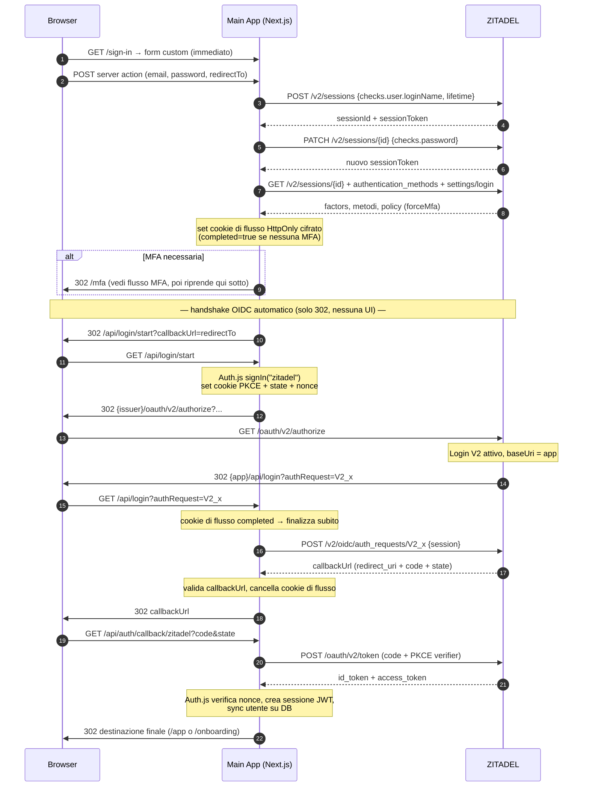
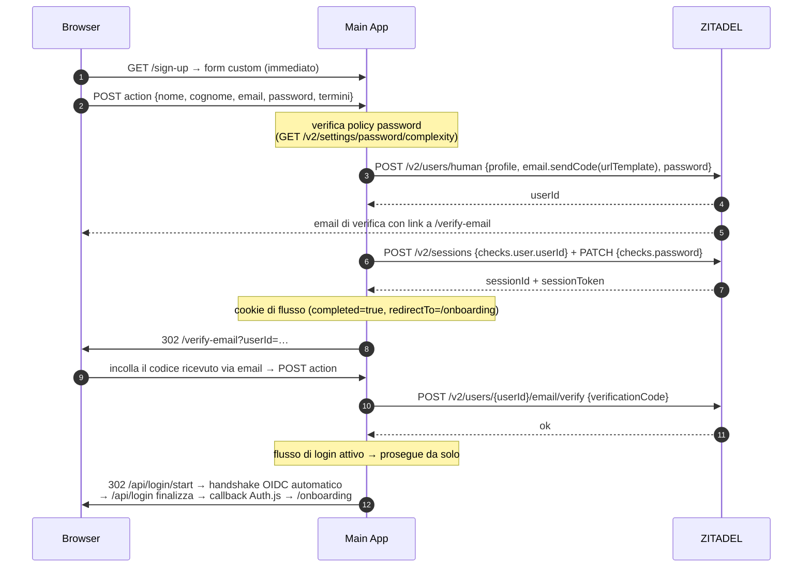
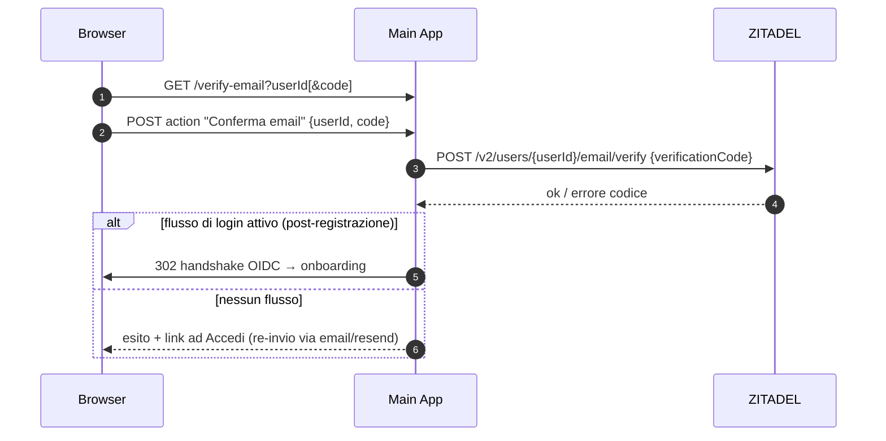
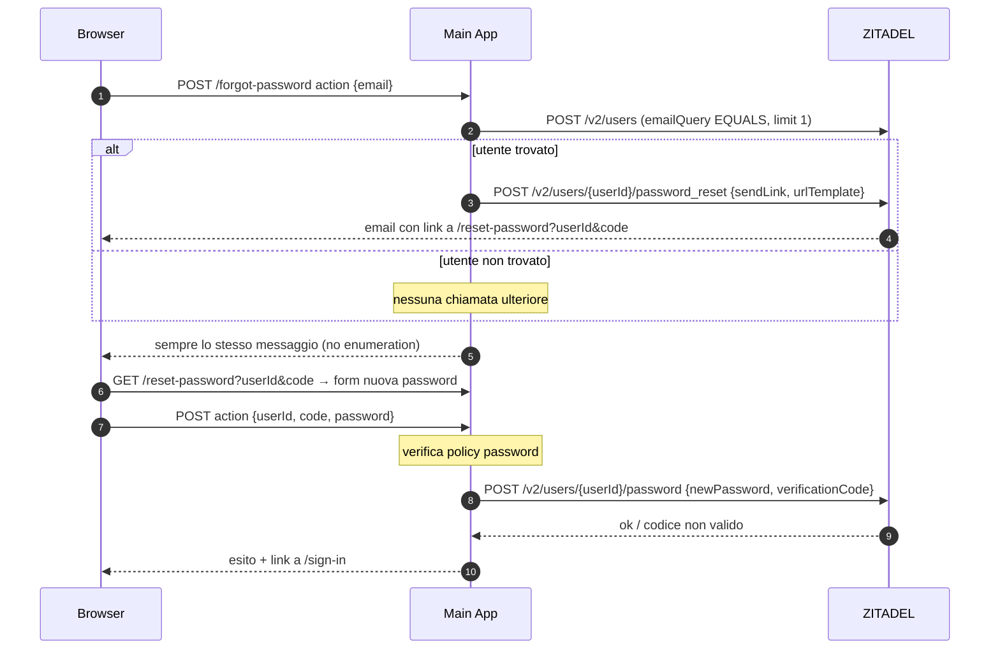
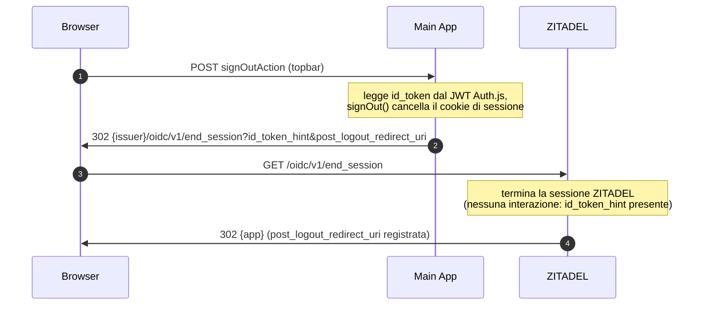

# Flussi di autenticazione — Custom Login UI ZITADEL

Tutti i flussi mantengono l'utente sul dominio della Main App: il dominio
ZITADEL compare solo in redirect 302 intermedi. Le chiamate alle API v2
partono sempre dal backend con il PAT del login client.

## Login con password (form-first)

Il form compare **subito** su `/sign-in`, senza alcun redirect preliminare.
Credenziali ed eventuale MFA vengono verificate via API; solo a
autenticazione completata parte l'handshake OIDC, che è una catena di
redirect invisibili finalizzata automaticamente.



Password errata o utente inesistente producono lo **stesso** messaggio
(«Credenziali non valide»); l'account bloccato dalla lockout policy ha un
messaggio dedicato.

## MFA (secondo fattore)

```mermaid
sequenceDiagram
  autonumber
  participant B as Browser
  participant App as Main App
  participant Z as ZITADEL

  B->>App: GET /mfa
  Note over App: legge cookie di flusso;<br/>senza cookie → 302 /sign-in
  App->>Z: GET /v2/users/{userId}/authentication_methods
  Z-->>App: [TOTP, U2F, OTP_EMAIL, ...]
  App->>B: pagina con i metodi disponibili

  alt TOTP
    B->>App: POST action {method: totp, code}
    App->>Z: PATCH /v2/sessions/{id} {checks.totp.code}
  else OTP email / SMS
    B->>App: POST action "invia codice"
    App->>Z: PATCH /v2/sessions/{id} {challenges.otpEmail|otpSms}
    Z-->>B: email / SMS con il codice
    B->>App: POST action {method, code}
    App->>Z: PATCH /v2/sessions/{id} {checks.otpEmail|otpSms.code}
  else Passkey / U2F
    B->>App: POST action "challenge webauthn"
    App->>Z: PATCH /v2/sessions/{id} {challenges.webAuthN}
    Z-->>App: publicKeyCredentialRequestOptions
    App-->>B: options
    B->>B: navigator.credentials.get()
    B->>App: POST action {assertion}
    App->>Z: PATCH /v2/sessions/{id} {checks.webAuthN}
  end

  Z-->>App: nuovo sessionToken (fattore verificato)
  Note over App: cookie di flusso → completed=true
  App->>B: 302 /api/login/start → handshake OIDC automatico<br/>(come nel login: authorize → /api/login → finalizza → callback Auth.js)
```

## Registrazione (form-first)



## Verifica email

Due ingressi equivalenti: subito dopo la registrazione (codice incollato a
mano) oppure dal link nell'email (urlTemplate →
`/verify-email?userId={{.UserID}}&code={{.Code}}`, codice precompilato):



## Password dimenticata / reset



## Logout



Se l'`id_token` non è disponibile il logout resta locale con redirect
diretto alla landing.

## Casi particolari

- **Auth request esterna**: se una authorize request raggiunge `/api/login`
  senza un flusso completo (es. avviata da un altro client OIDC
  dell'istanza), l'utente è portato al form custom con `?authRequest=V2_…`
  (o a `/sign-up` per `prompt=create`); il form la finalizza dopo il login
  (`pendingRequestId` nel cookie di flusso).
- **`prompt=none`**: `/api/login` chiude subito la auth request con
  `ERROR_REASON_LOGIN_REQUIRED` e rimanda il browser alla `redirect_uri`
  del client (validata) — nessuna UI.
- **Auth request scaduta/riusata**: la finalizzazione fallisce → redirect a
  `/sign-in?error=flow` con messaggio e possibilità di ripartire.
- **Cookie di flusso scaduto (>15 min) o incompleto**: `/mfa` e le action
  rimandano a `/sign-in?error=flow`; `/api/login` non finalizza mai un
  flusso non `completed`.
- **Annulla su /mfa**: cancella il cookie di flusso e torna a `/sign-in`.
